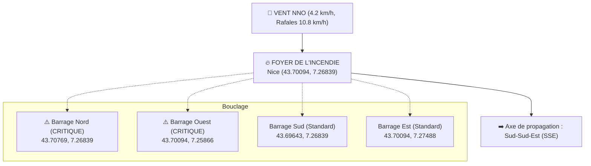

# Rapport Logistique & Tactique Sapeurs-Pompiers — Nice (06000)

> [!IMPORTANT]
> **Rapport opérationnel destiné au Commandement (PC Ops / CODIS)**  
> **Dernière mise à jour :** 2026-06-03 à 08:35:40  
> **Localisation du foyer :** Nice Centre (43.70094, 7.26839)  
> **Niveau de danger global :** **2/5 (MODÉRÉ)**

---

## 1. Synthèse de la situation et Alerte

Le niveau de danger opérationnel est classé **2/5 (MODÉRÉ)**. Bien que la météo actuelle soit calme (vent faible), la végétation environnante présente un risque **ÉLEVÉ** en raison de la présence de garrigue inflammable qui favorise une propagation rapide au sol. 16 établissements à forte vulnérabilité (hôpitaux, cliniques) se trouvent dans le rayon d'impact.

---

## 2. Conditions Météorologiques & Prévisions

Les conditions météo actuelles sont globalement favorables mais nécessitent une surveillance attentive quant à la rotation des vents en fin de nuit.

### Conditions Actuelles
| Paramètre | Valeur | Statut / Alerte |
| :--- | :--- | :--- |
| **Température** | 20.9 °C | Température stable |
| **Humidité relative** | 60 % | Humidité stable (pas d'alerte immédiate) |
| **Vent Moyen** | 4.2 km/h | Faible |
| **Rafales** | 10.8 km/h | Modérées |
| **Direction du Vent** | 340° (NNO) | Vent soufflant du Nord-Nord-Ouest |
| **Précipitations** | 0.0 mm | Sec |

> [!NOTE]
> Aucun seuil d'alerte météo critique n'est franchi actuellement (vent moyen < 50 km/h, humidité > 30%).

### Prévisions sur les 3 Prochaines Heures
| Heure | Vent moyen | Rafales | Direction | Humidité relative |
| :--- | :--- | :--- | :--- | :--- |
| **00:00** | 6.7 km/h | 13.0 km/h | NO (Nord-Ouest) | 89 % |
| **01:00** | 6.9 km/h | 11.5 km/h | NO (Nord-Ouest) | 91 % |
| **02:00** | 7.7 km/h | 13.0 km/h | NO (Nord-Ouest) | 85 % |

---

## 3. Analyse du Combustible & Végétation

L'analyse de la couverture végétale par l'API Overpass dans un rayon de 2000 m autour du foyer montre un combustible inflammable.

*   **Total polygones de végétation identifiés :** 31
    *   **Forêt dense / Bois :** 21 zones
    *   **Garrigue / Maquis :** 10 zones
    *   **Lande sèche :** 0 zone
*   **Essences recensées :** Feuillus et forêts mixtes (broadleaved, mixed). Aucun résineux critique n'est formellement confirmé sur les tags OSM.
*   **Évaluation du risque combustible :** **ÉLEVÉ**
    *   *Détail :* La présence de 10 zones de garrigue sèche implique un risque de propagation rapide au sol avec des flammes basses mais très mobiles en cas de saut de feu.

---

## 4. Dimensionnement Logistique & Tactique

Conformément au niveau de danger de **Niveau 2**, les moyens logistiques à déployer sont les suivants :

### Moyens Humains et Matériels
*   **Rayon de couverture tactique :** 1.0 km
*   **Nombre de camions de lutte (CCF/CS) :** 4 camions
*   **Unités en Garde Active :** 2 unités
*   **Unités en attente (réserve tactique) :** 1 unité
*   **Moyens Aériens :** Aucun engagé d'office (uniquement sur demande expresse du CODIS en cas de saut de feu sur garrigue).

### Plan de Bouclage & Barrages Routiers (GPS)
Les barrages sont positionnés aux limites de sécurité. En raison du vent de secteur NNO, les axes Nord et Ouest sont prioritaires et classés **CRITIQUE**.

| Poste | Latitude | Longitude | Rôle & Statut |
| :--- | :--- | :--- | :--- |
| 🚧 **Barrage Nord** | 43.70769 | 7.26839 | ⚠️ **BARRAGE CRITIQUE** — Positionné sur l'axe du vent (propagation fumée) |
| 🚧 **Barrage Ouest** | 43.70094 | 7.25866 | ⚠️ **BARRAGE CRITIQUE** — Positionné sur le flanc ouest |
| 🚧 **Barrage Sud** | 43.69643 | 7.26839 | Barrage de sécurisation standard |
| 🚧 **Barrage Est** | 43.70094 | 7.27488 | Barrage de sécurisation standard |

### Zone de Fumée & Point de Repli
*   **Axe de propagation de la fumée :** Vers le Sud-Sud-Est (SSE), poussée par le vent NNO.
*   **Point de fumée estimé (front de fumée) :** GPS [43.70769, 7.25866](https://www.google.com/maps/search/?api=1&query=43.70769,7.25866) (zone sous les fumées, port d'appareil respiratoire isolant recommandé pour les reconnaissances).
*   **Point de repli recommandé pour les civils :** GPS [43.69418, 7.27812](https://www.google.com/maps/search/?api=1&query=43.69418,7.27812) (secteur dos au vent, hors de la trajectoire des fumées).

---

## 5. Vulnérabilité & Ordre d'Évacuation

Dans un rayon de 2500 mètres autour du foyer, **209 structures sensibles** ont été identifiées. Les évacuations doivent suivre un ordre strict de priorité.

### Synthèse des Vulnérabilités
*   **Évacuation Priorité CRITIQUE :** 16 structures (Hôpitaux, Cliniques, EHPAD - personnes dépendantes ou alitées)
*   **Évacuation Priorité HAUTE :** 163 structures (Écoles, Collèges, Lycées, Crèches)
*   **Rayon d'analyse :** 2.5 km

### Liste des 16 Établissements Critiques (Hôpitaux & Cliniques)
Ces établissements doivent être contactés immédiatement par le PC Ops pour préparer un confinement ou une évacuation médicalisée si le feu progresse.

| # | Nom de l'établissement | Type | Distance | Coordonnées GPS | Téléphone | Adresse |
| :--- | :--- | :--- | :--- | :--- | :--- | :--- |
| 1 | **Centre Thérapeutique de Nice** | Clinique | 0.34 km | [43.69901, 7.27165](https://www.google.com/maps/search/?api=1&query=43.69901,7.27165) | Non renseigné | Adresse non renseignée |
| 2 | **Cabinet Infirmier** | Clinique | 1.19 km | [43.70678, 7.25594](https://www.google.com/maps/search/?api=1&query=43.70678,7.25594) | Non renseigné | Adresse non renseignée |
| 3 | **Clinique Atlantis** | Clinique | 1.25 km | [43.70249, 7.25296](https://www.google.com/maps/search/?api=1&query=43.70249,7.25296) | +33 4 92 26 73 00 | Adresse non renseignée |
| 4 | **Clinique du Parc Impérial** | Clinique | 1.34 km | [43.70309, 7.25197](https://www.google.com/maps/search/?api=1&query=43.70309,7.25197) | +33 8 26 30 75 76 | Adresse non renseignée |
| 5 | **Institut de médecine bucco-dentaire** | Clinique | 1.69 km | [43.70255, 7.28933](https://www.google.com/maps/search/?api=1&query=43.70255,7.28933) | +33 4 92 03 32 70 | Adresse non renseignée |
| 6 | **SOS Médecins** | Clinique | 1.75 km | [43.71289, 7.28252](https://www.google.com/maps/search/?api=1&query=43.71289,7.28252) | +33 4 93 85 01 01 | 2 Rue Justin Montolivo, Nice |
| 7 | **Clinique Villa la Tour** | Clinique | 1.79 km | [43.71634, 7.27487](https://www.google.com/maps/search/?api=1&query=43.71634,7.27487) | Non renseigné | Adresse non renseignée |
| 8 | **Hôpital de jour Le Bellagio CHS Ste-Marie** | Hôpital / Clinique | 1.81 km | [43.71593, 7.25957](https://www.google.com/maps/search/?api=1&query=43.71593,7.25957) | +33 4 93 13 56 10 | 18 Avenue Cyrille Besset |
| 9 | **Cabinet Infirmier** | Clinique | 2.08 km | [43.71114, 7.29008](https://www.google.com/maps/search/?api=1&query=43.71114,7.29008) | Non renseigné | 24 Rue Monseigneur Alfred Daumas, Nice |
| 10 | **Cabinet Infirmier** | Clinique | 2.08 km | [43.71907, 7.26207](https://www.google.com/maps/search/?api=1&query=43.71907,7.26207) | Non renseigné | Adresse non renseignée |
| 11 | **Centre Thérapeutique La Madeleine - CMP** | Clinique | 2.20 km | [43.69611, 7.24179](https://www.google.com/maps/search/?api=1&query=43.69611,7.24179) | +33 4 93 71 42 32 | 35 Boulevard de la Madeleine |
| 12 | **Soins Infirmiers** | Clinique | 2.22 km | [43.70978, 7.29322](https://www.google.com/maps/search/?api=1&query=43.70978,7.29322) | Non renseigné | Adresse non renseignée |
| 13 | **Pole Santé** | Clinique | 2.25 km | [43.70947, 7.29383](https://www.google.com/maps/search/?api=1&query=43.70947,7.29383) | Non renseigné | 16 Boulevard Pape Jean XXIII, Nice |
| 14 | **Clinique Saint-Dominique** | Clinique | 2.27 km | [43.72113, 7.26408](https://www.google.com/maps/search/?api=1&query=43.72113,7.26408) | +33 4 92 07 57 57 | 16 Avenue Henry Dunant |
| 15 | **Hôpital de Cimiez** | Hôpital / Clinique | 2.28 km | [43.72111, 7.27346](https://www.google.com/maps/search/?api=1&query=43.72111,7.27346) | Non renseigné | 4 Avenue de la Reine Victoria |
| 16 | **Fondation Lenval - Hôpital pour Enfants** | Hôpital / Clinique | 2.50 km | [43.68944, 7.24165](https://www.google.com/maps/search/?api=1&query=43.68944,7.24165) | +33 4 92 03 03 92 | Adresse non renseignée |

### 10 Premières Structures Hautes Proches du Foyer (Écoles & Crèches)
Ces structures d'enseignement et d'aide sociale doivent faire l'objet d'une alerte immédiate pour confinement ou évacuation préventive si des fumées denses s'orientent vers elles.

1.  **Lycée Michelet** (École / Collège / Lycée) — à 0.19 km (43.70033, 7.27060) | *Tél:* Non renseigné
2.  **Villa Foch** (Structure Sociale) — à 0.23 km (43.70302, 7.26866) | *Tél:* +33 4 92 47 76 00
3.  **Établissement scolaire Sasserno** (École / Collège / Lycée) — à 0.25 km (43.70247, 7.27071) | *Tél:* +33 4 93 80 03 61 | *Adresse:* 1 Place Sasserno, Nice
4.  **Institut Jeanne de France** (École / Collège / Lycée) — à 0.27 km (43.70055, 7.26504) | *Tél:* Non renseigné
5.  **École Condé** (École / Collège / Lycée) — à 0.29 km (43.70329, 7.27006) | *Tél:* Non renseigné
6.  **Lycée général et technologique Albert Calmette** (École / Collège / Lycée) — à 0.36 km (43.70338, 7.27141) | *Tél:* Non renseigné
7.  **Collège-Lycée Privé Michelet** (École / Collège / Lycée) — à 0.43 km (43.69939, 7.27326) | *Tél:* +33 4 93 85 30 32
8.  **École Rothschild Mixte 2** (École / Collège / Lycée) — à 0.45 km (43.70265, 7.27352) | *Tél:* Non renseigné
9.  **École Rothschild Mixte 1** (École / Collège / Lycée) — à 0.48 km (43.70309, 7.27359) | *Tél:* Non renseigné
10. **CeGIDD - Nice** (Structure Sociale) — à 0.49 km (43.70013, 7.26235) | *Tél:* +33 4 89 04 55 60